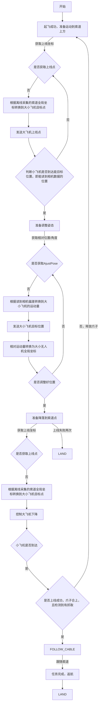

```mermaid
graph TD
    A[开始] --> B[起飞成功，准备运动到索道上方]
    B -->|获取上线坐标| C{是否获取上线点}
    C -->|否| D[根据离线采集的索道全局坐标转换到大小飞机目标点]
    D --> E[发送大飞机上线点]
    E --> F{判断小飞机是否到达能目标位置，即能读到相机数据的位置}
    F -->|是| G[准备调整姿态]
    F -->|否| C
    G -->|获取相对位置/角度| H{是否获取AjustPose}
    H -->|否| I[根据读到相机偏差转换到大小飞机的运动量]
    I --> J[发送大小飞机目标位置]
    J --> K[相对运动量转换为大小无人机全局坐标]
    K --> L{是否调整好位置}
    L -->|是| M[准备降落到索道点]
    L -->|否| H
    M -->|获取上线坐标| N{是否获取上线点}
    N -->|否| O[根据离线采集的索道全局坐标转换到大小飞机目标点]
    O --> P[控制大飞机下降]
    P --> Q{小飞机是否到达}
    Q -->|是| R{是否上线成功，爪子合上，且检测到有抓取}
    R -->|是| S[FOLLOW_CABLE]
    R -->|否，释放爪子| B
    S -->|跟随索道| T[任务完成，返航]
    T --> U[LAND]
    M -->|上线失败两次| W[LAND]
```