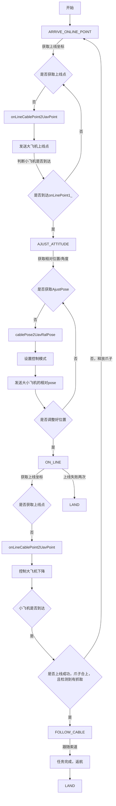

```mermaid
graph TD
    A[开始] --> B[ARRIVE_ONLINE_POINT]
    B -->|获取上线坐标| C{是否获取上线点}
    C -->|否| D[onLineCablePoint2UavPoint]
    D --> E[发送大飞机上线点]
    E -->|判断小飞机是否到达| F{是否到达onLinePoint1_}
    F -->|是| G[AJUST_ATTITUDE]
    F -->|否| C
    G -->|获取相对位置/角度| H{是否获取AjustPose}
    H -->|否| I[cablePose2UavRalPose]
    I --> J[设置控制模式]
    J --> K[发送大小飞机的相对pose]
    K --> L{是否调整好位置}
    L -->|是| M[ON_LINE]
    L -->|否| H
    M -->|获取上线坐标| N{是否获取上线点}
    N -->|否| O[onLineCablePoint2UavPoint]
    O --> P[控制大飞机下降]
    P --> Q{小飞机是否到达}
    Q -->|是| R{是否上线成功，爪子合上，且检测到有抓取}
    R -->|是| S[FOLLOW_CABLE]
    R -->|否，释放爪子| B
    S -->|跟随索道| T[任务完成，返航]
    T --> U[LAND]
    M -->|上线失败两次| W[LAND]
```